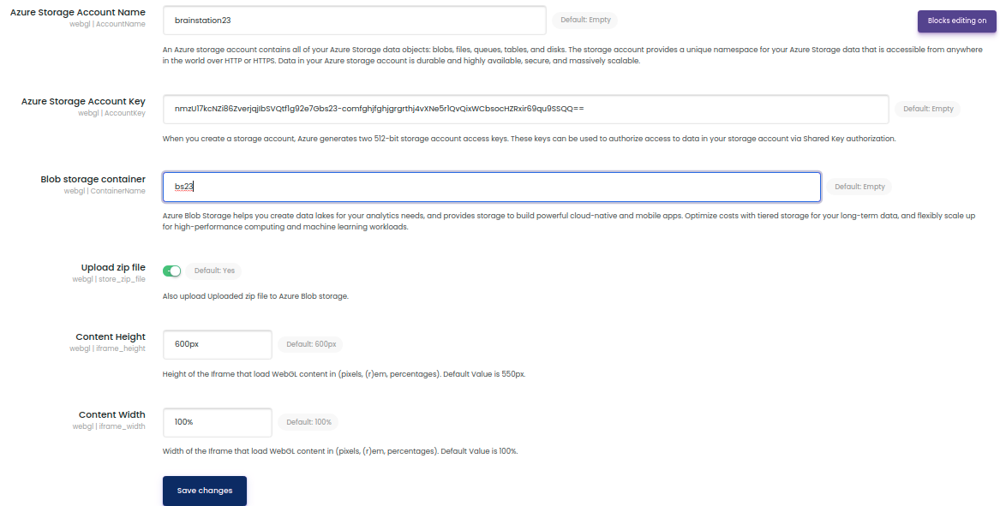
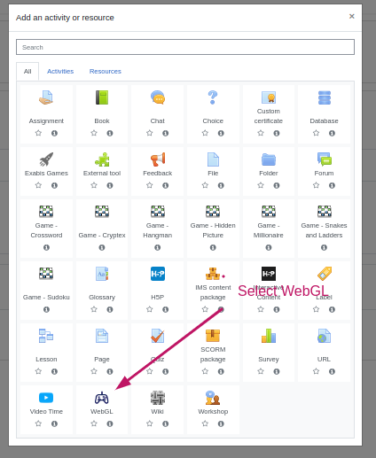
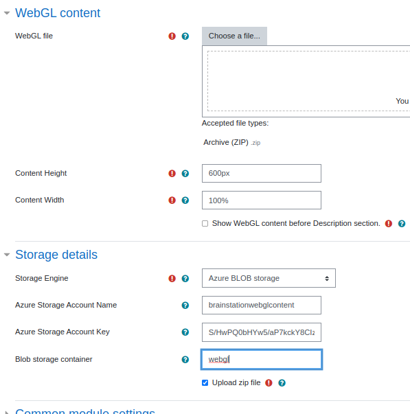
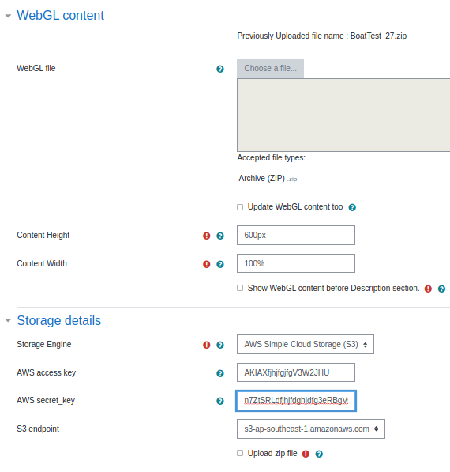
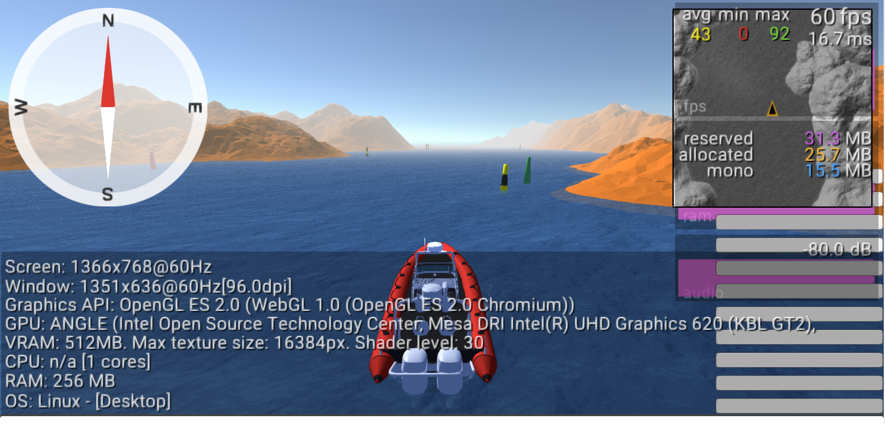

# Moodle WebGL Activity plugin with 
 - Azure Blob storage WebGL content Upload
 - AWS S3 WebGL content Upload


# Getting Started

## Dependency: S3 repository

## Minimum Requirements

* Moodle 3.8 or higher
* See [composer.json](composer.json) for dependencies
* Required extension for PHP:
  * php_fileinfo.dll
  * php_mbstring.dll
  * php_openssl.dll
  * php_xsl.dll

* Recommended extension for PHP:
  * php_curl.dll

## Download Source Code

To get the source code from GitHub, type

```
git clone https://github.com/eLearning-BS23/webgl.git
```

## Installation
1. Go to Project root/mod directory 
2. clone code by using following commands
```
git clone https://github.com/eLearning-BS23/webgl.git webgl
cd webgl

```
3. Open a command prompt and execute following commands (Optional) 
```
php composer.phar install
```

## Plugin Settings 


## Choose WebGL Activity
 

## WebGL Add Form
 

## WebGL Edit Form
 

## WebGL Game View
 
